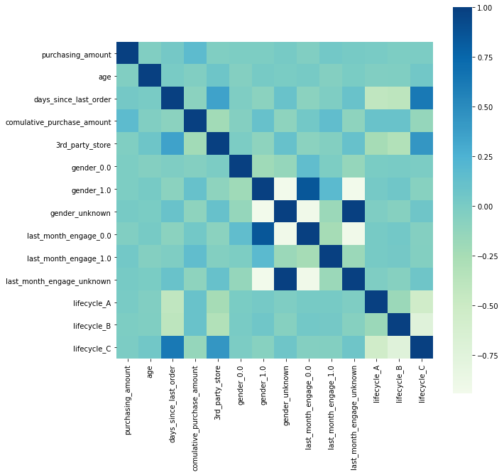

# Case study: RED-小红书

## Background 

RED(小红书), established in June 2013, is an online shopping and social networking platform in Mainland China. 

The website claims to have 200 million users since January 2019.
In its community, users and celebrities can share product reviews and tourist destination introductions.

RED uses machine learning to accurately and efficiently match massive amounts of information with people. 
It has accumulated massive amounts of overseas shopping data, analyzed the most popular products and global shopping trends.
Based on this, RED provides good products to users with a shortest path and a most concise way. 

## Analysis goal 

Based on user data and consumer behavior data
* Use jupyter notebook to build a linear regression model
* Forecast changes of user's consumption amount
* Find the factors that have a greater impact on user consumption

## 1 Data analysis 
### Index explanation 
* purchasing_amount: the amount user purchases
* gender: male->1, female->0, U= unknown 
* age 
* 3rd_party_store: user puchases from the third party merchant
* comulative_purchase_amount: comulative amount user purchases
* days_since_last_order
* last_month_engage: activity user engages in the past month
* lifecycle: A: registered within 6 month, B: registered within one year, C: registered within two years

## 2 Univariate analysis
### 2.1 numerical variables
#### Conclusion: 

* According to the distplot of age and red['age'].describe(), we can see
- 1. The user age is distributed between 18-99 years old, 
- 2. The average user age is 60.39 years old, 
- 3. The median user age is 60.39 years old, 
- 4. The vast majority of users are between 58 - 63 years old.

* From the days since last order, we can see 
- 1. The number of days since the last time a user placed an order is distributed between 0 and 23 days. 
- 2. All users have made orders within this month.
- 3. The user will make an order again after an average of 7.7 days. 
- 4. The frequency of 0-1 days from the last time the user made an order is relatively higher. 

### 2.2 categorical variables

#### Conclusion : 

Relationship between different lifecycles and purchasing amount: 
- 1. Lifecycle C, in which the users registered within 2 years are the most. 

- 2. Lifecycle A, in which the users registered within 6 months, has most average purchasing amount, reachs 433.8, second one is lifecylce C, which is registered within 2 years, reaches 396.8, the least is lifecycle B, which is registered within 1 year, reaches 381.3.
- 3. Lifecycle C has most puchasing amount in total, second one is lifecylce B, the last one is lifecycle A. 

- 4. Most of total purchasing amount is created by lifecycle C.

Relationship between gender and purchasing amount: 
 
- 1. There are more male users than female users.
- 2. Purchasing amount by male users are little higher than female users. 

- 3. Male users contribute most part of total puchasing amount. 

Relationship between users' last month puchasing and purchasing amount:

Conclusion: 
- 1. Most users do not make orders during the last month.
- 2. The average of purchasing amount among users that have engaged during last month is larger. The purchasing amount reaches 569.7 while the amount of users that do not engaged is 369.8.
- 3. Most of total purchasing amount is contributed by the users that do not engaged in the past month. 

Relationship between third party stores and purchasing amount:
Conclusion: 
- 1. Users who have never purchased in a third-party app are the most, followed by those who have purchased 10 times in a third-party stores. 
- 2. The average sales of customers who have never made a purchase in a third-party stores is the highest; the average sales of customers who have made 1-5 purchases in a third-party stores similar; the average of customers who have made 6-10 purchases in a third-party stores Sales are similar, but its purchasing amount is greater than the average sales of 1-5 purchases on third-party apps. 
- 3. Most of the total sales are contributed by users who have never purchased in a third-party stores, followed by users who have purchased 10 times in a third-party store. Users who have made 1-5 purchases in a third-party app, with the least contribution Customers who made 6-10 purchases in a third-party stores.

## 3 Visualization

Conclusion: 
- There exist strong pairwise positive relations between lifecycle C and days since last order and third party stores.
- There exist strong pairwise positive relations between gender_1.0 and last month engage 0.
- There is no clear relations between puchasing amount and other variables. 
## 4 Regression 
### 4.1 Evaluate model

### 4.2 Model score

* Root Mean Square Error(RMSE) = 945.1327326407894. It amplifies the margin of error, and the penalty for the error is heavier.
* Mean Absolute Error(MAE) = 352.9825670606424. It better reflects the actual situation of the predicted value error.
Conclusion: 
- R-squared is 0.03, Prob is 0
- This regression has no significant meaning. 

## 4.3 Model refinement 
Add one more variable lifecycle_C
* Root Mean Square Error(RMSE) = 945.0664751321252
* Mean Absolute Error(MAE) = 352.6020358581729

## 4.4  Prediction analysis of sales model : 
prediction sales amount = 186.8375 + 0.0684 * comulative_purchase_amount + 62.6521 * last_month_engage_1.0 + 8.9856  * days_since_last_order - 31.0249 * lifecycle_C

